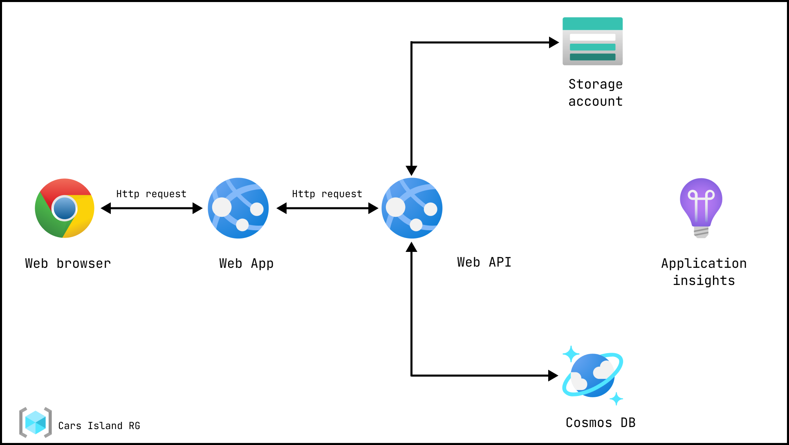

# Repository for Cars Island rental solution

Demo project that contains examples of use:

- APIM
- ARM templates
- Terraform infrastructure provisioning
- Kubernetes deployments via azure pipelines to AKS cluster
- Deployments to classic Azure App Service

Architecture diagram:

Web App Screen:

### Docker build & run Web API

- **Required env. vars:**
    - `CosmosConnectionString`
    - `BlobKey`
    - `BlobConnectionString`

- **Commands:**
    - `docker build -t "cars-island-webapi" ./src/cars-island-web-api`
    - `docker run -d -p 9000:80 --name cars-island-api "cars-island-webapi:latest" -e "CosmosConnectionString=$env:CosmosConnectionString" -e "BlobKey=$env:BlobKey" -e "BlobConnectionString=$env:BlobConnectionString"`

### Docker build & run Web App

- **Required env. vars:**
    - `BlobServerAddress`
    - `ApiAddress`

- **Commands:**
    - `docker build -t "cars-island-webapp" ./src/cars-island-web-app`
    - `docker run -d -p 8002:80 --name cars-island-app "cars-island-webapp:latest" -e "ApiAddress=http://cars-island-webapi:9000" -e "BlobServerAddress=https://carislandstorage1.blob.core.windows.net/cars-images-container/"`

### Required Nuget Packages

- `Azure.Cosmos`
- `Azure.Storage.Blobs`
- `Microsoft.Extensions.Logging.Abstractions`
- `Microsoft.Extensions.Options`

### Infrastructure provisioning

- **Configure subscription**
    - `az login`
    - `az login --use-device-code`
    - `az account subscription list`
    - `az account set --subscription "name or id"`
    - List all subscriptions showing default: `az account list -o table`
    - `az logout`

- **Create Resource Group**
    - `az group create --name "rg-car-rental-solution" --location "westus"`

- **Create Azure App Service**
    - `az appservice plan create --name "carislandplan" --resource-group "rg-car-rental-solution" --sku "F1"`
    - `az webapp list-runtimes`
    - `az webapp create --resource-group "rg-car-rental-solution" --name "app-car-rental-webapi" --plan "carislandplan" --runtime "dotnet:6"`
    - `az webapp create --resource-group "rg-car-rental-solution" --name "app-car-rental-webapp" --plan "carislandplan" --runtime "dotnet:6"`

- **Create Azure Cosmos DB**
    - `az cosmosdb create --name "cosmos-acc-car-island" --resource-group "rg-car-rental-solution"`
    - `az cosmosdb sql database create --account-name "cosmos-acc-car-island" --resource-group "rg-car-rental-solution" --name "azuredevtemplatesdb"`
    - `az cosmosdb sql container create -g "rg-car-rental-solution" -a "cosmos-acc-car-island" -d "azuredevtemplatesdb" -n "products" --partition-key-path "/id"`

- **Create ACR**
    - `az acr create --resource-group "rg-car-rental-solution" --name "carsislandacr" --sku "Basic"`

- **Create ACR Service Principal**
    - `$ACR_REGISTRY_ID=$(az acr show --name "carsislandacr" --query "id" --output tsv)`
    - `az ad sp create-for-rbac --name "CarsIslandACR_SP" --scopes $ACR_REGISTRY_ID --role acrpush`

- **Create Blob Container**
    - `az storage account create --name "carislandstorage1" --resource-group "rg-car-rental-solution" --location "westus" --sku "Standard_LRS" --kind "StorageV2"`
    - `az storage container create --name "cars-images-container" --account-name "carislandstorage1" --public-access "blob"`
    - `az storage account show-connection-string --name "carislandstorage1" --resource-group "rg-car-rental-solution" --subscription "Azure for Students"`
    - Upload images to the
      blob: `azcopy copy "./images/*" "https://carislandstorage1.blob.core.windows.net/cars-images-container?[SAS]" --recursive=true`

- **Create Analytics Workspace**
    - `az monitor log-analytics workspace create --resource-group "rg-car-rental-solution" --workspace-name "car-rental-workspace"`

### Deploy apps

- API
    - `dotnet publish --configuration Release --output .\bin\publish`
    - `Compress-Archive .\bin\publish\* .\api.zip -Force`
    - `az webapp deployment source config-zip --resource-group "rg-car-rental-solution" --src "api.zip" --name "app-car-rental-webapi"`
- Web App
    - `dotnet publish --configuration Release --output .\bin\publish`
    - `Compress-Archive .\bin\publish\* .\app.zip -Force`
    - `az webapp deployment source config-zip --resource-group "rg-car-rental-solution" --src "app.zip" --name "app-car-rental-webapp"`

### Deploy rg via ARM template

- `az deployment sub create --location "westus" --parameters "./arm-templates/rg-azure-deploy.parameters.dev.json" --template-file "./arm-templates/rg-azure-deploy.json"`
- `az deployment sub create --location "westus" --parameters "./arm-templates/rg-azure-deploy.parameters.qa.json" --template-file "./arm-templates/rg-azure-deploy.json"`

### Deploy ARM template

- Create resource group
    - `$rgName="rg-ubuntu-vm-arm"`
    - `$location="westus"`
    - `az group create -n $rgName -l $location`

- Deploy template
    - `$templatePath = "./arm_templates/exported-portal-rg-ubuntu-vm/template.json"`
    - `$parametersPath = "./arm_templates/exported-portal-rg-ubuntu-vm/parameters.json"`
    - `az deployment group create -g $rgName --template-file $templatePath --parameters $parametersPath`

- [How to deploy arm template](https://github.com/kolosovpetro/Roadmap.AZ204/blob/master/DevelopAzureComputeSoultions/04_arm_template_deploy_cli.md)

### Sources

- [Pluralsight Implementing Orchestration Automation Solutions](https://app.pluralsight.com/library/courses/microsoft-devops-solutions-implementing-orchestration-automation-solutions/table-of-contents)
- [Deploy ARM using CLI](https://markheath.net/post/deploying-arm-templates-azure-cli)
- [Create resource group using ARM](https://stackoverflow.com/questions/47670797/azure-arm-template-create-resource-group)
- [Azure deployment sub CLI](https://learn.microsoft.com/en-us/cli/azure/deployment/sub?view=azure-cli-latest#az-deployment-sub-create)
