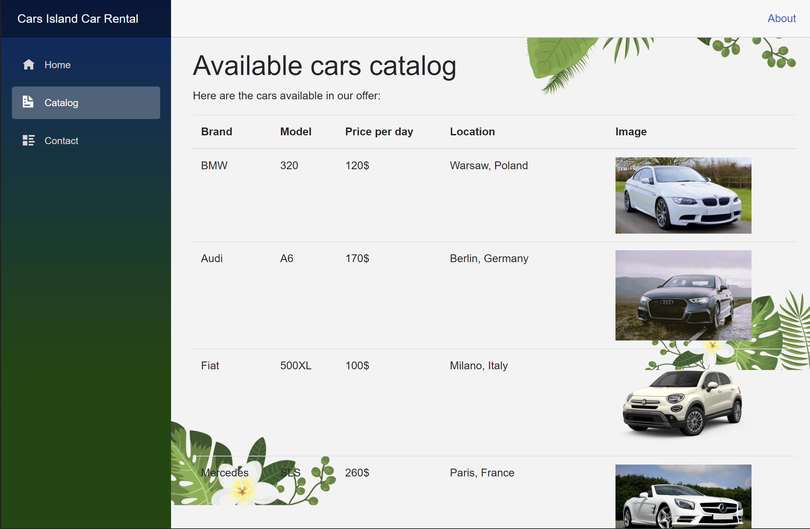
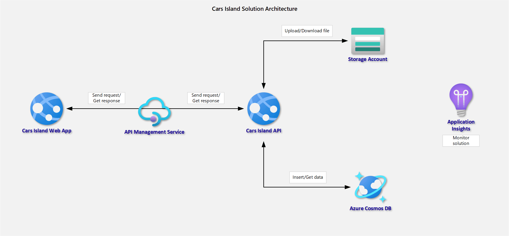

# Repository for Cars Island rental solution

## 1. Car Island API

#### Required Nuget Packages

- `Azure.Cosmos`
- `Azure.Storage.Blobs`
- `Microsoft.Extensions.Logging.Abstractions`
- `Microsoft.Extensions.Options`

#### Infrastructure provisioning

- Create Resource Group
- Create Azure App Service
- Create Azure Cosmos DB

