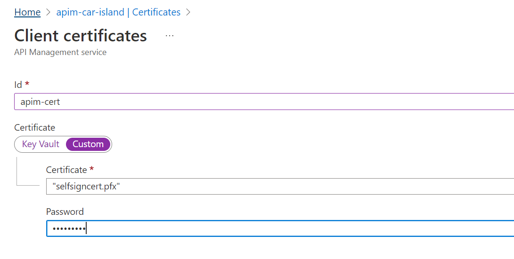
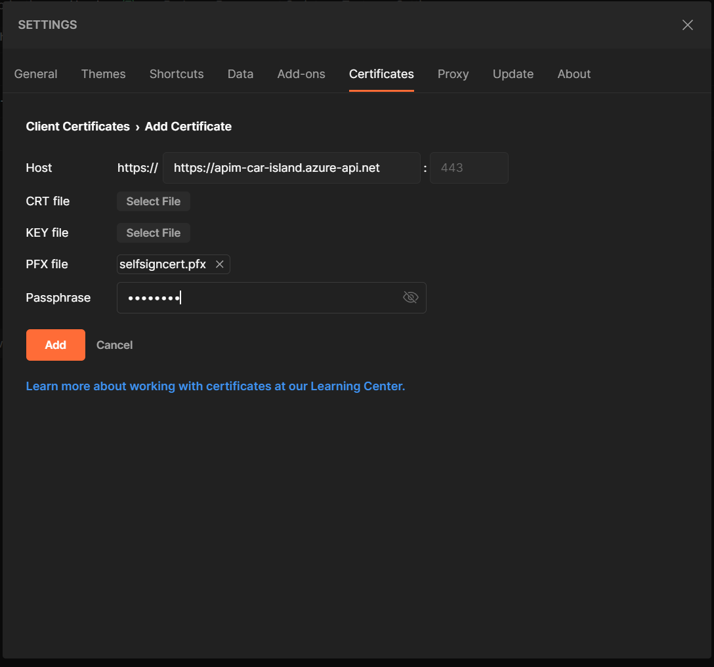
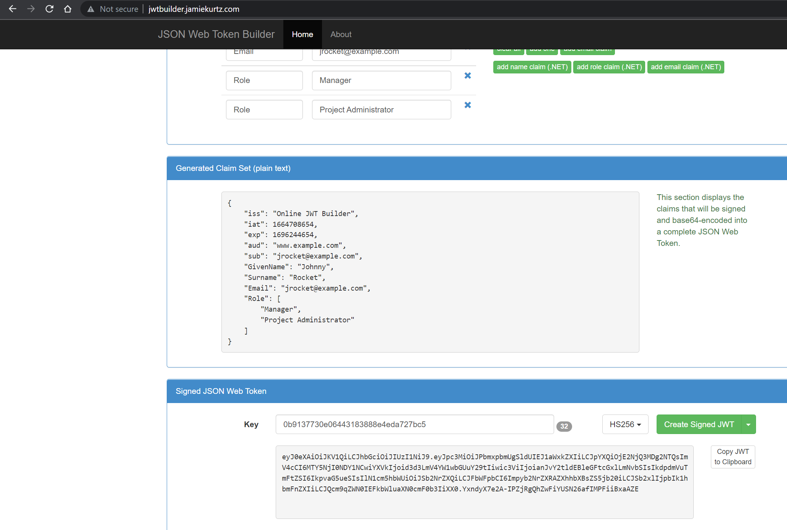
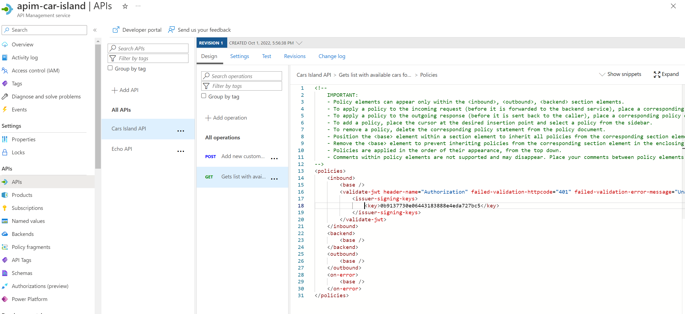
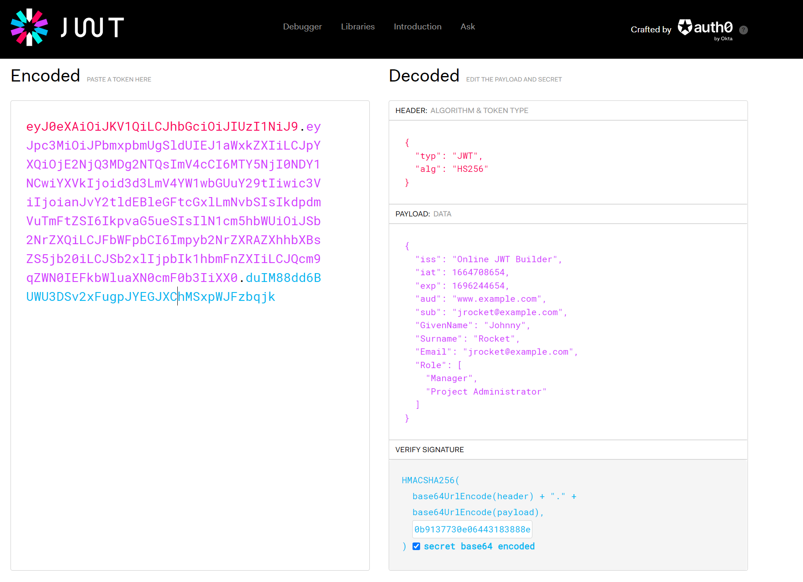
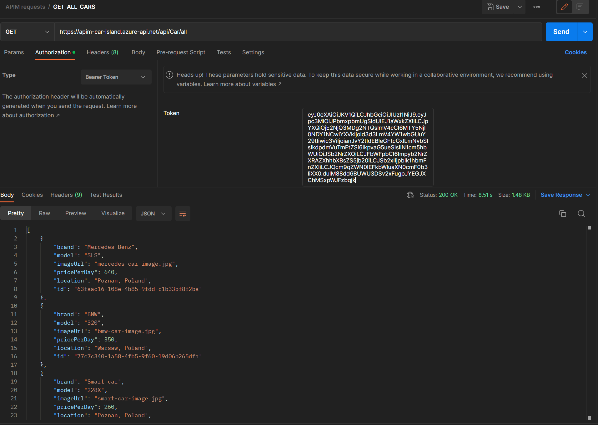

# Generate certificate

In powershell run:

- `$pwd="Test1234@"`
- `$pfxFilePath="D:\RiderProjects\MonitoringAndLogging.AZ204\cert\selfsigncert.pfx"`
- `openssl req -x509 -sha256 -nodes -days 365 -newkey rsa:2048 -keyout privateKey.key -out selfsigncert.crt -subj /CN=localhost`
- `openssl pkcs12 -export -out $pfxFilePath -inkey privateKey.key -in selfsigncert.crt -password pass:$pwd`
- `openssl pkcs12 -in selfsigncert.pfx -out selfsigncert.pem -nodes`

# Add Certificate Azure Portal

# Add Certificate Postman

# Configure JWT validation policy

- Choose a signing key, for example GUID: `0b9137730e06443183888e4eda727bc5`
- Sign some test token with it, using http://jwtbuilder.jamiekurtz.com

- Update sign key inside APIM as per screenshot

- Copy token to the https://jwt.io
- Validate its signature
- Check `secret base64 encoded`

- Copy-paste token from jwt.io to the postman as Bearer Auth Header and send request

